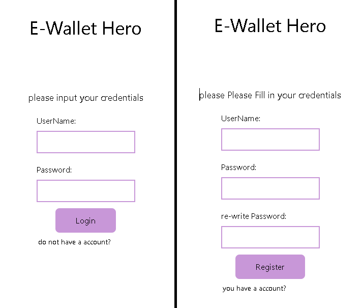
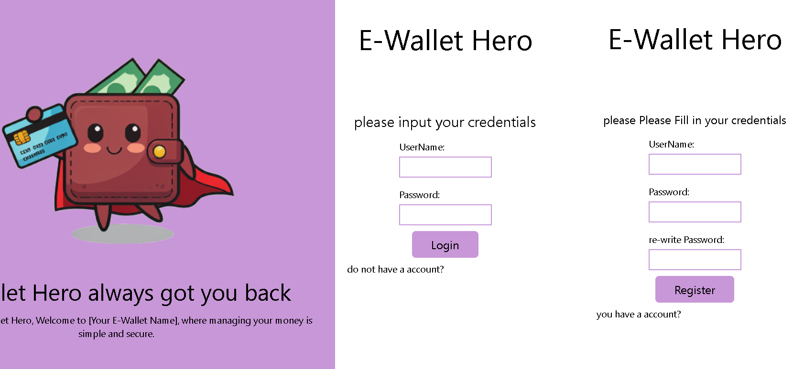
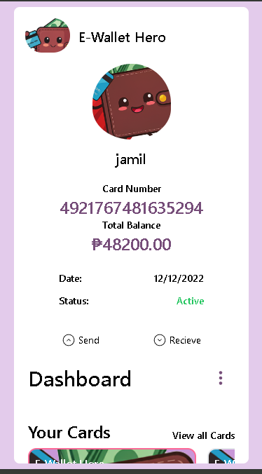
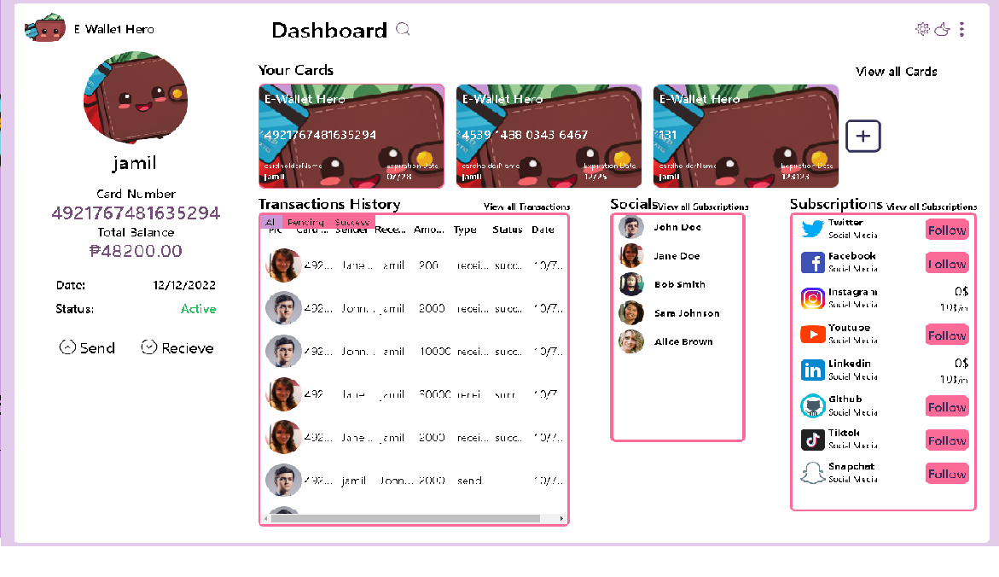
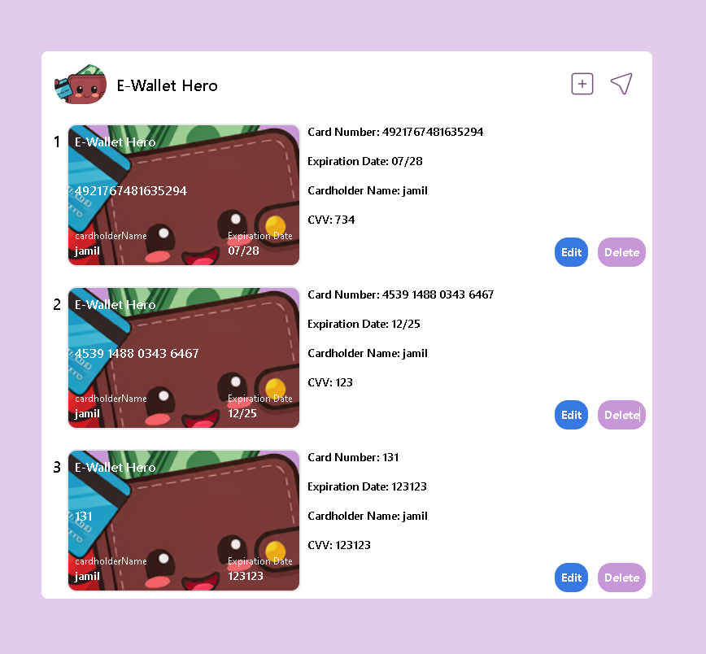
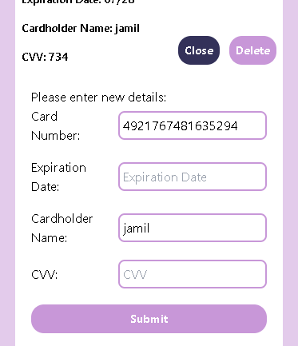
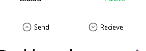
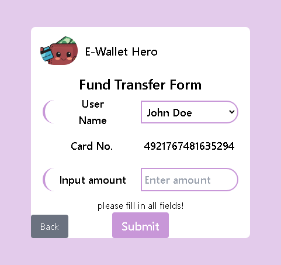
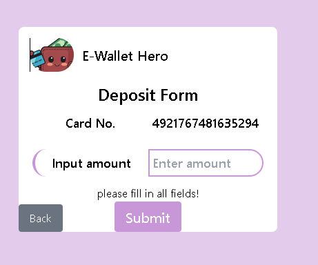
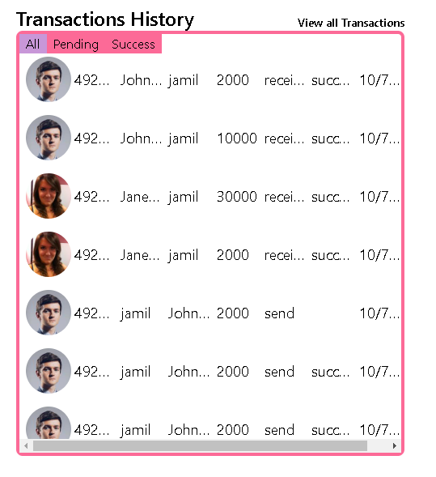

# E-Wallet Application

Welcome to the **E-Wallet Application**. This project is a digital wallet platform that allows users to manage cards, send/receive money, and track transactions.

## Getting Started

Follow these steps to run the project on your local machine.

### Prerequisites

- **Node.js** (v14 or higher)
- **npm** (Node Package Manager)

### Installation

1. **Clone the Repository**

   Open your terminal and clone the repository by running:
   ```bash
   git clone <repository-url>
   ```

2. **Navigate to the Project Directory**

   Once the repository is cloned, move to the project folder:
   ```bash
   cd <project-folder-name>
   ```

3. **Install Dependencies**

   Run the following command to install all required packages and dependencies:
   ```bash
   npm install
   ```

4. **Start the Development Server**

   Launch the app locally using:
   ```bash
   npm run dev
   ```

5. **Access the Application**

   After the development server starts, open your browser and navigate to:
   ```
   http://localhost:5173
   ```

### Optional: Enable Mobile View for Testing

To simulate mobile behavior and responsiveness:

6. **Open Developer Tools**

   Right-click anywhere on the web page and select **Inspect** (or press `Ctrl+Shift+I` / `Cmd+Option+I` on macOS).

7. **Toggle Device Toolbar**

   In the Developer Tools panel, click the **Toggle Device Toolbar** button (second button in the top-left corner, looks like a mobile and tablet icon). This will allow you to switch between desktop and mobile views.

---

### Notes
- Ensure you have **Node.js** and **npm** installed before running the project.
- For the best experience, test the app in both desktop and mobile views.

---

# App Features

## 1. Login System

### After clicking "Let's Get Started":
- You will be directed to the login system.
- If you don't have an account, click on **"Do not have an account"** to sign up.

### Screenshots:

#### Mobile


#### Desktop


---

## 2. Dashboard

Once logged in, you'll be directed to the dashboard.

### Screenshots:

#### Mobile


#### Desktop


---

## 3. Card Management

### If you’ve just created an account:
You will notice that there are no cards available.


### To create a new card:

Fill out the form to get your new card:


### Sample Card Details:
If you face issues creating a card, use these sample details:

1. **Card 1**:
   - **Card Number**: 4485 3032 7098 5634
   - **Expiration Date**: 12/26
   - **CVV**: 354

2. **Card 2**:
   - **Card Number**: 5398 4729 1845 7821
   - **Expiration Date**: 09/25
   - **CVV**: 612

---

## 4. View and Edit Cards

You can view all your saved cards:



You can also edit any card:



1. Fill in the required information.
2. Submit the form to update your card details.

---

## 5. Send or Receive Money

This feature allows you to send or receive money easily.



### Sending Money:

Click on the **Send** button to initiate a fund transfer.



1. Use the dropdown to select the recipient.
2. Enter the amount to send.
3. Submit the transfer.

### Receiving Money:

Click on the **Receive** button to accept money.



1. Enter the amount to receive.
2. Submit the request.

---

## 6. Transaction History

All your transactions are saved in the local storage for future reference.



---

Enjoy using the **E-Wallet Application**!